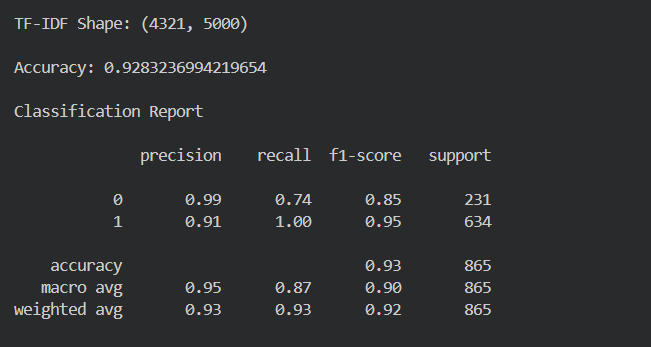
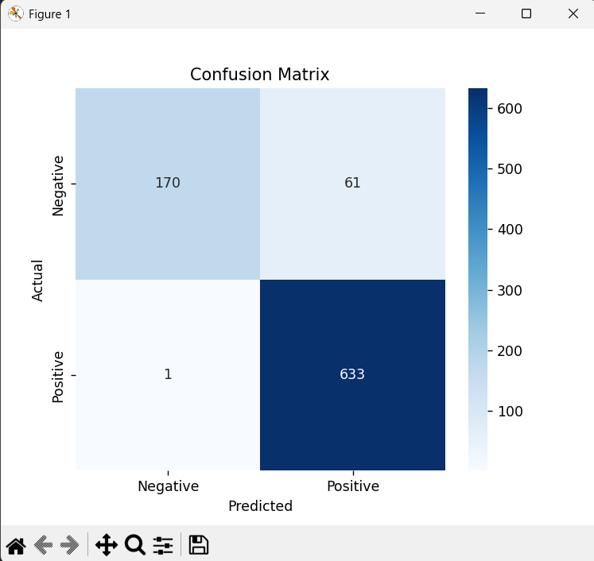
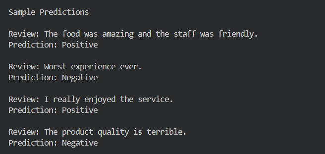
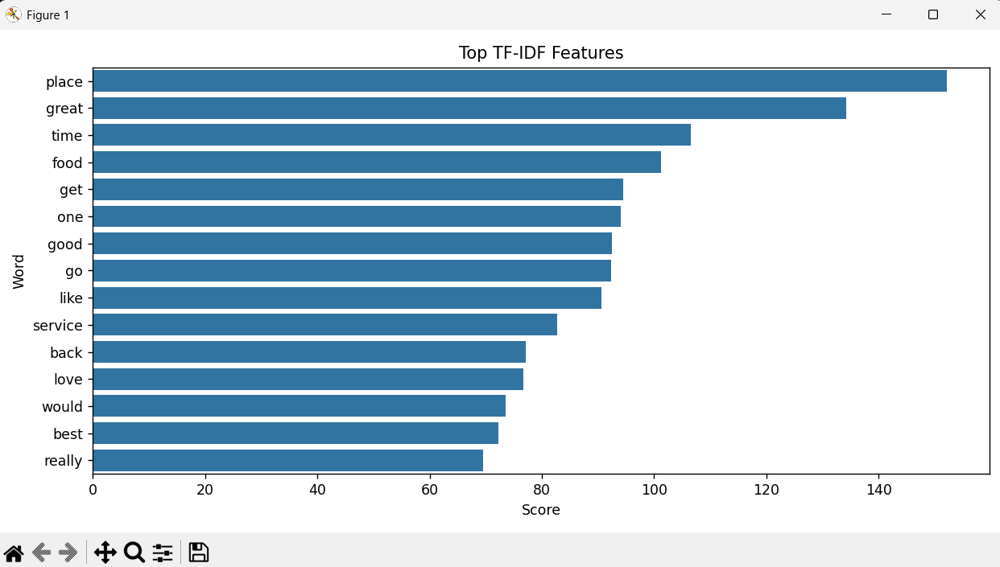

# NLP Sentiment Analysis using TF-IDF & Naive Bayes

## 📌 Overview

This project demonstrates Sentiment Analysis using Natural Language Processing (NLP). Customer reviews are preprocessed and converted into numerical features using TF-IDF Vectorization. A Multinomial Naive Bayes classifier is then trained to classify reviews as Positive or Negative.

---

## 🎯 Objective

- Perform text preprocessing
- Convert text into TF-IDF features
- Train a Naive Bayes classifier
- Evaluate model performance
- Predict sentiment of unseen reviews

---

## 📂 Dataset

- Dataset: TestReviews.csv
- Total Reviews: 4,321
- Target Labels:
  - 1 → Positive
  - 0 → Negative

---

## 🛠 Technologies Used

- Python
- Pandas
- NumPy
- NLTK
- Scikit-learn
- Matplotlib
- Seaborn

---

## 📚 Libraries

```python
pandas
numpy
nltk
scikit-learn
matplotlib
seaborn
```

---

## ⚙️ Project Workflow

1. Load Dataset
2. Text Preprocessing
   - Lowercase Conversion
   - Remove Special Characters
   - Stopword Removal
   - Lemmatization
3. TF-IDF Vectorization
4. Train-Test Split
5. Train Multinomial Naive Bayes Model
6. Model Evaluation
7. Predict Sentiment of New Reviews

---

## 📊 Model Performance

- Accuracy: **92.83%**

### Classification Metrics

- Precision
- Recall
- F1-Score
- Accuracy

---

## 📸 Screenshots

### Classification Report



---

### Confusion Matrix



---

### Sample Predictions



---

### Top TF-IDF Features


### Sample Predictions

Shows predictions on custom review examples.

---

## 📁 Project Structure

```
Project 4/
│
├── NLP_Sentiment_Analysis.py
├── TestReviews.csv
├── Sample_Predictions.csv
├── README.md
└── Screenshots/
    ├── Confusion_Matrix.png
    ├── Classification_Report.png
    ├── TFIDF_Features.png
    └── Sample_Predictions.png
```

---

## 🚀 Results

- Successfully classified customer reviews into Positive and Negative sentiments.
- Achieved **92.83% accuracy** using TF-IDF and Multinomial Naive Bayes.
- Generated predictions for unseen customer reviews.

---

## 👨‍💻 Author

**Aryan Tiwari**

B.Tech Computer Science Engineering Student

